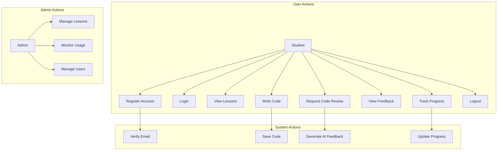
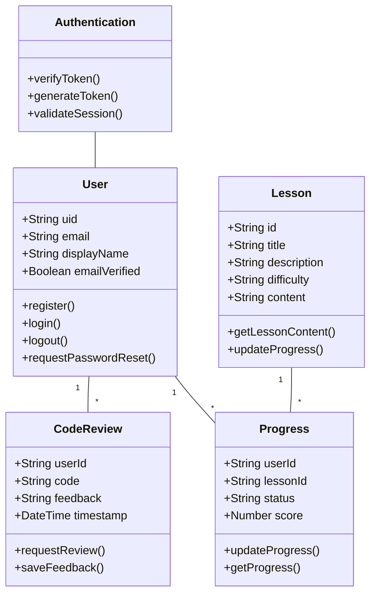

# AI Code Learning Platform

An interactive platform for learning to code with AI-powered feedback and guidance.

## Features

- Interactive code editor with syntax highlighting
- AI-powered code review and feedback
- Structured learning paths and lessons
- Modern, responsive UI

## System Design

### Use Case Diagram



### Class Diagram



## Setup

1. Create a virtual environment and activate it:
```bash
python -m venv venv
source venv/bin/activate  # On Windows: venv\Scripts\activate
```

2. Install dependencies:
```bash
pip install -r requirements.txt
```

3. Create a `.env` file in the root directory and add your OpenAI API key:
```
OPENAI_API_KEY=your_api_key_here
```

4. Run the application:
```bash
python app.py
```

5. Open your browser and navigate to `http://localhost:5000`

## Technology Stack

- Backend: Flask (Python)
- Frontend: HTML, CSS (Tailwind CSS), JavaScript
- Code Editor: CodeMirror
- AI Integration: OpenAI GPT-3.5
- Authentication: Firebase
- Database: Firestore

## Security Features

- Email verification required for new accounts
- Secure session management with cookies
- Protected API endpoints with JWT authentication
- Input validation and sanitization
- CSRF protection

## Project Structure

```
.
├── app.py              # Main Flask application
├── requirements.txt    # Python dependencies
├── .env               # Environment variables
├── static/
│   ├── auth.js        # Authentication logic
│   ├── script.js      # Main application logic
│   ├── style.css      # Custom styles
│   ├── index.html     # Main application page
│   ├── login.html     # Login page
│   └── register.html  # Registration page
└── README.md          # Project documentation
